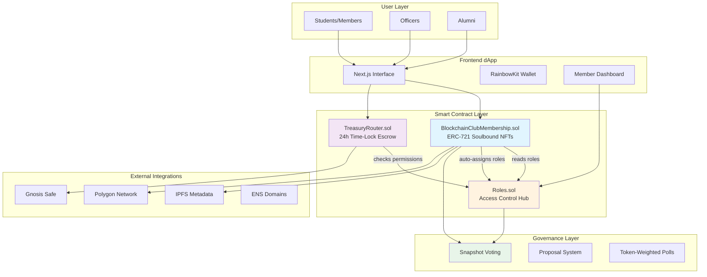

# Technical Specification

This document describes the contract architecture and internal logic for the Blockchain Club membership system. It is intended for developers, auditors, and contributors seeking a clear overview of how the smart contracts operate.

---

## Overview

The system uses modular, upgradeable smart contracts to handle:

- NFT-based role assignment (membership tokens)
- Role management (Admin / Officer / Member)
- Escrowed treasury functions (ETH, ERC20, NFT)

All contracts follow the UUPS proxy upgrade standard and enforce granular access control through `AccessControlEnumerable`.

### System Architecture



---

## Contracts

### 1. `BlockchainClubMembership.sol`

ERC721-based membership tokenization protocol with hierarchical access control and comprehensive governance mechanisms.

**Protocol Features:**
- ERC721Enumerable with UUPS upgradeability pattern
- Hash-based token type identification system
- Temporal minting constraints with configurable access windows
- Soulbound token enforcement for governance-critical NFTs
- Configurable metadata architecture with base URI management
- Automated role assignment integration with `Roles.sol`

**Core Functions:**
- `mint(to, tokenType, isSoulbound)` – Officer-authorized token issuance
- `publicMint(tokenType, isSoulbound)` – Public minting with access validation
- `requestWhitelist()` – Permissioned onboarding request system
- `processWhitelistRequest(requestId, approve)` – Officer-mediated approval workflow
- `createTokenType(...)` – Token type configuration and deployment
- `burnToken(tokenId)` – Officer-authorized token destruction
- `setBaseURI()` – Admin-controlled metadata URI management
- `initialize(name, symbol, rolesAddr)` – Proxy initialization with role integration

**Security Model:**
- Admin-restricted upgrade authorization and metadata control
- Officer-gated token operations and whitelist management
- Token type configuration determines public access parameters
- Comprehensive reentrancy protection on state modifications

---

### 2. `Roles.sol`

Hierarchical access control protocol implementing OpenZeppelin's `AccessControlEnumerable` with voting power distribution.

**Role Hierarchy:**
- `ADMIN_ROLE` – Protocol-level privileges (contract upgrades, voting power configuration)
- `OFFICER_ROLE` – Operational authority (token operations, whitelist governance)
- `MEMBER_ROLE` – Base membership tier with governance participation

**Voting Power Distribution:**
- Officer tier: 5x voting weight multiplier (configurable)
- Member tier: 1x base voting weight (configurable) 
- Individual voting power overrides supported per address

**Core Functions:**
- `grantRole(role, account)` / `revokeRole(role, account)` – Role assignment operations
- `grantRoleBatch(role, accounts)` / `revokeRoleBatch(role, accounts)` – Batch role operations
- `hasRole(role, account)` – Role verification queries
- `getVotingPower(account)` – Effective voting weight calculation
- `getUserCurrentRole(account)` – Highest role identification
- `setVotingPower(role, power)` – Admin-controlled role-based voting configuration
- `setCustomVotingPower(account, power)` – Admin-controlled individual voting overrides

---

### 3. `TreasuryRouter.sol`

Time-delayed multi-asset management protocol supporting ETH, ERC20, and ERC721 transfers with comprehensive security mechanisms.

**Protocol Architecture:**
- 24-hour temporal security lock on all asset transfers
- Multi-asset support: ETH, ERC20 tokens, and ERC721 NFTs
- Separated deposit and execution phases for security validation
- Comprehensive metadata tracking for audit trails
- Emergency administrative controls for protocol security
- Batch execution optimization for gas efficiency

**Core Functions:**
- `receiveFunds()` / `receiveFundsWithMeta(metadata)` – ETH deposit operations
- `depositERC20(token, amount, metadata)` – ERC20 token deposit protocol
- `depositNFT(token, tokenId, metadata)` – NFT deposit and custody
- `executeTransferBatch(transferIds)` – Batch ETH transfer execution
- `executeERC20TransferBatch(transferIds)` – Batch token transfer execution
- `executeNFTTransferBatch(transferIds)` – Batch NFT transfer execution
- `cancelERC20Transfer(transferId, reason)` / `cancelNFTTransfer(transferId, reason)` – Administrative cancellation
- `updateTreasury(newTreasury)` – Treasury address reconfiguration
- `emergencyWithdraw()` – Emergency protocol controls
- `setTreasury(address)` – Treasury recipient configuration (Gnosis Safe recommended)

**Escrow Execution Flow:**
1. Officer initiates asset deposit with metadata
2. Transfer queued with temporal lock and comprehensive tracking
3. 24-hour security window enforced before execution eligibility
4. Administrative cancellation authority prior to execution

---

## Protocol Interaction Architecture

```
[User] --(mint request)--> [Membership Contract]
  ↓                              ↓
[Role Assignment]         [NFT Issuance]
  ↓                              ↓
[Roles.sol]              [Token Metadata]

[Officer/Admin] --(deposit)--> [TreasuryRouter]
                                    ↓
                          [24h Temporal Lock]
                                    ↓
                         [Gnosis Safe Execution]
```

---

## Performance Analysis

**Gas Optimization:**
- Contract deployment costs optimized for production use
- All contracts remain under 24KB size limit for mainnet deployment
- Function execution costs analyzed and documented

📊 [Detailed gas analysis](../analysis/gas-analysis.md)

**Code Quality:**
- Comprehensive static analysis via Solhint
- Security patterns validated
- Best practices enforced across codebase

📋 [Code quality report](../analysis/code-quality.md)

---

## Upgradeability & Administrative Controls

- UUPS upgradeability pattern implementation across all contracts
- `ADMIN_ROLE` maintains exclusive upgrade authorization
- Production upgrades require multisig or Gnosis Safe execution

---

## Deployment Protocol

- Proxy initialization via `initialize()` functions (UUPS pattern compliance)
- Deployment sequence requirements:
  1. `Roles.sol` – Base access control deployment
  2. `BlockchainClubMembership.sol` – NFT system with roles integration
  3. `TreasuryRouter.sol` – Asset management with membership verification

---

## Protocol Considerations

- Temporal constraints utilize `block.timestamp`. Edge-case scenarios require monitoring
- Off-chain whitelist synchronization requires state consistency with smart contract storage
- ERC721 tokens implement soulbound functionality when flagged during minting (transfer restrictions)

---

## Implementation Status

This specification documents the production version deployed on Polygon Amoy testnet. Mainnet deployment scheduled following comprehensive frontend integration and external security audit completion.

**Protocol Resources:**
* Website: https://untrackedtx.xyz
* Repository: https://github.com/untracked-tx/blockchain-club
* Technical Contact: Liam.Murphy@ucdenver.edu

---

## Error Handling

### Contract Failure Management

The smart contracts implement comprehensive error handling patterns to ensure robust operation and clear failure modes:

**Access Control Errors:**
- `AccessControl: account X is missing role Y` - Thrown when unauthorized accounts attempt privileged operations
- `Roles: caller not authorized` - Custom error for role verification failures
- `Pausable: paused` - Emitted when operations are attempted on paused contracts

**Membership Contract Errors:**
- `TokenType: not found` - Invalid token type hash provided
- `Whitelist: cooldown active` - Premature whitelist request submission
- `Mint: public access disabled` - Attempting public mint on restricted token types
- `Transfer: soulbound token` - Attempt to transfer non-transferable NFTs

**Treasury Router Errors:**
- `Transfer: insufficient balance` - Asset transfer exceeds available balance
- `Transfer: temporal lock active` - Execution attempted before 24-hour delay completion
- `Transfer: already executed` - Duplicate execution attempt on completed transfer

### Recovery Mechanisms

**Emergency Protocols:**
- Pause functionality enables immediate halt of operations during critical issues
- Admin role maintains emergency withdrawal capabilities for asset recovery
- Upgrade patterns allow bug fixes through proxy implementation updates

---

## Event Emissions

### Frontend Integration Events

The protocol emits comprehensive events for frontend synchronization and monitoring:

**Membership Events:**
```solidity
event TokenMinted(address indexed to, uint256 indexed tokenId, string tokenType, bool isSoulbound);
event WhitelistRequested(address indexed user, uint256 indexed requestId);
event WhitelistProcessed(uint256 indexed requestId, bool approved);
event TokenTypeCraeted(string indexed tokenType, bool publicAccess);
```

**Role Management Events:**
```solidity
event RoleGranted(bytes32 indexed role, address indexed account, address indexed sender);
event RoleRevoked(bytes32 indexed role, address indexed account, address indexed sender);
event VotingPowerUpdated(bytes32 indexed role, uint256 newWeight);
```

**Treasury Events:**
```solidity
event ETHDeposited(uint256 indexed transferId, uint256 amount, string metadata);
event TransferExecuted(uint256 indexed transferId, address indexed recipient, uint256 amount);
event TransferCancelled(uint256 indexed transferId, string reason);
event EmergencyWithdraw(address indexed admin, uint256 amount);
```

---

## Storage Layout

### Upgrade Safety Considerations

The contracts follow strict storage layout patterns to ensure safe upgrades:

**Base Storage Structure:**
- Inherited OpenZeppelin contracts maintain fixed storage positions
- Custom variables append to existing layout without gaps
- Storage gaps reserved for future extensions

**Critical Storage Variables:**
```solidity
// BlockchainClubMembership.sol
mapping(string => TokenTypeConfig) private _tokenTypes;
mapping(address => WhitelistRequest) private _whitelistRequests;
uint256 private _tokenCounter;
uint256[47] private __gap; // Reserved storage

// TreasuryRouter.sol  
mapping(uint256 => TransferRequest) private _transfers;
uint256 private _transferCounter;
address private _treasury;
uint256[47] private __gap; // Reserved storage
```

**Upgrade Protocol:**
1. Deploy new implementation contract
2. Verify storage layout compatibility
3. Execute upgrade through Admin multisig
4. Validate post-upgrade state integrity

---
