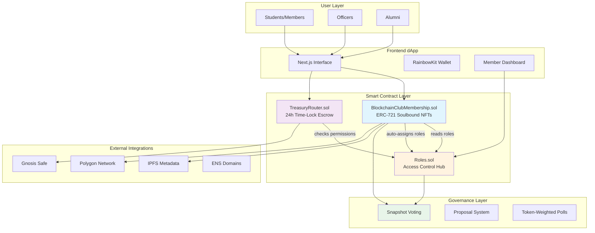
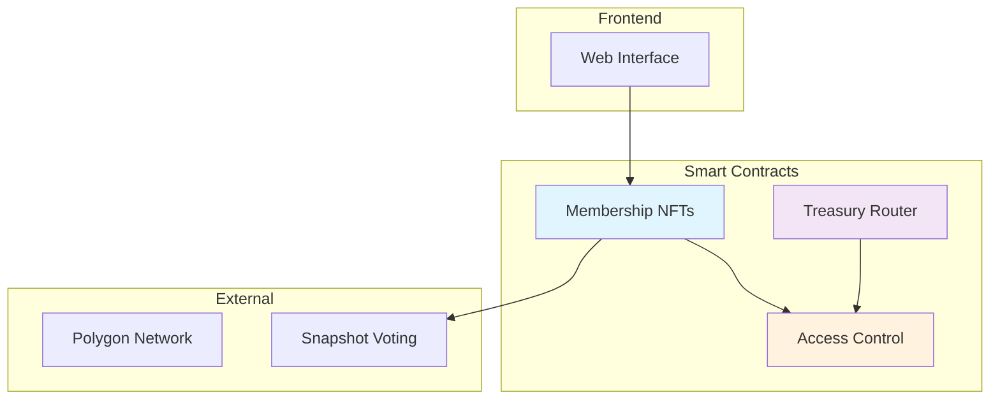
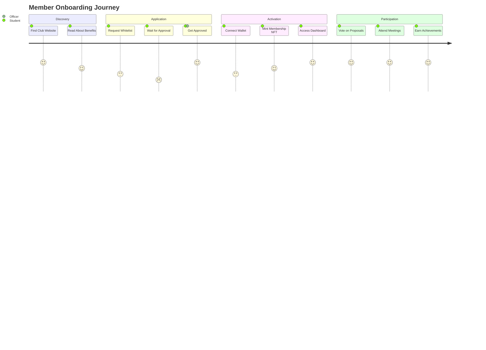
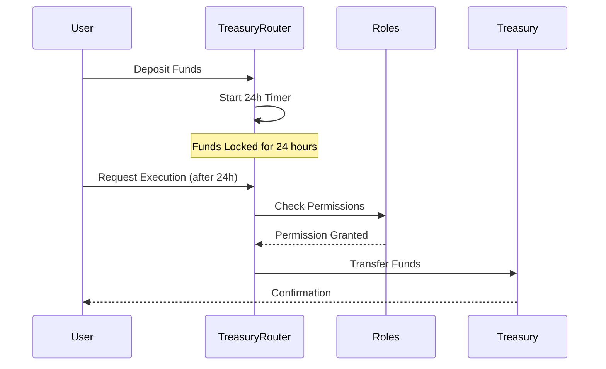
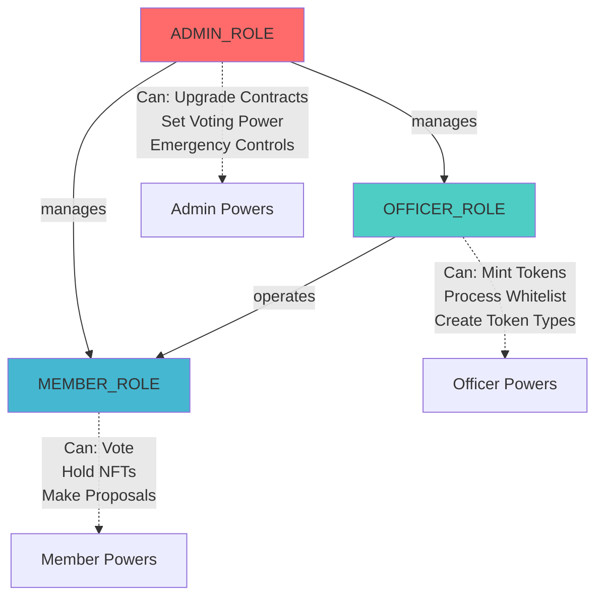
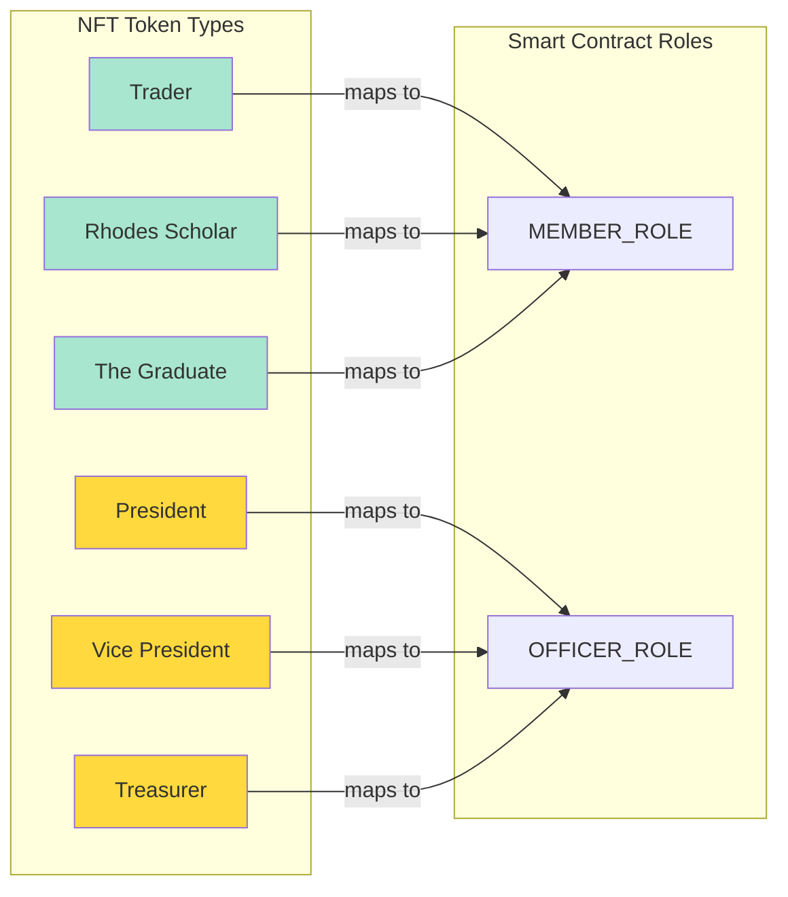
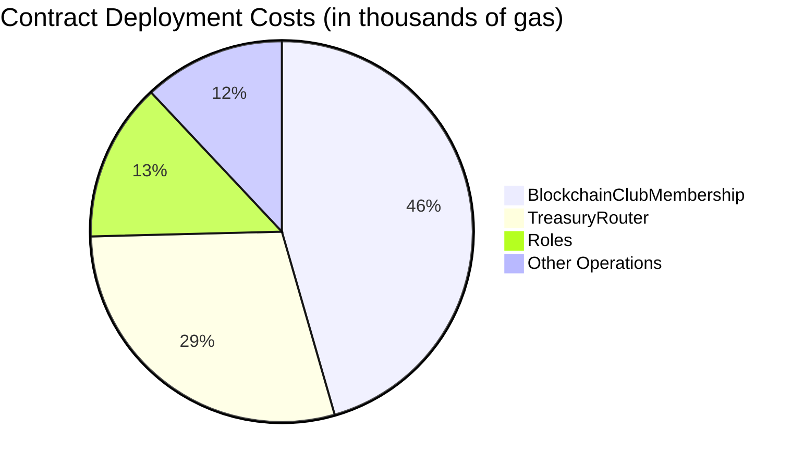
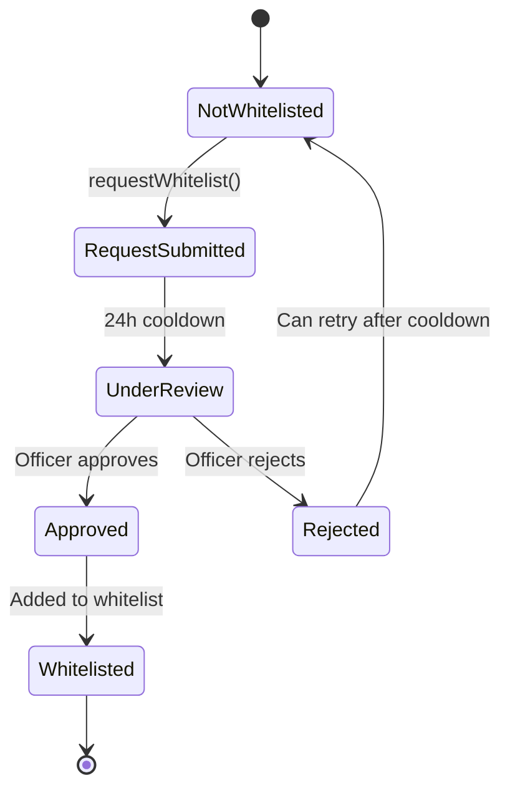
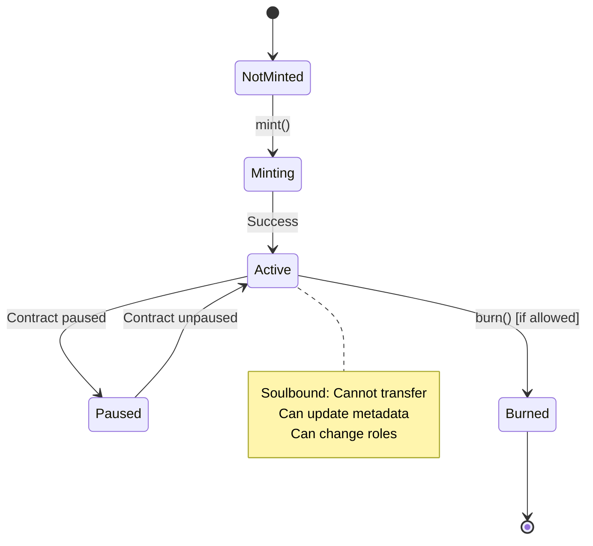
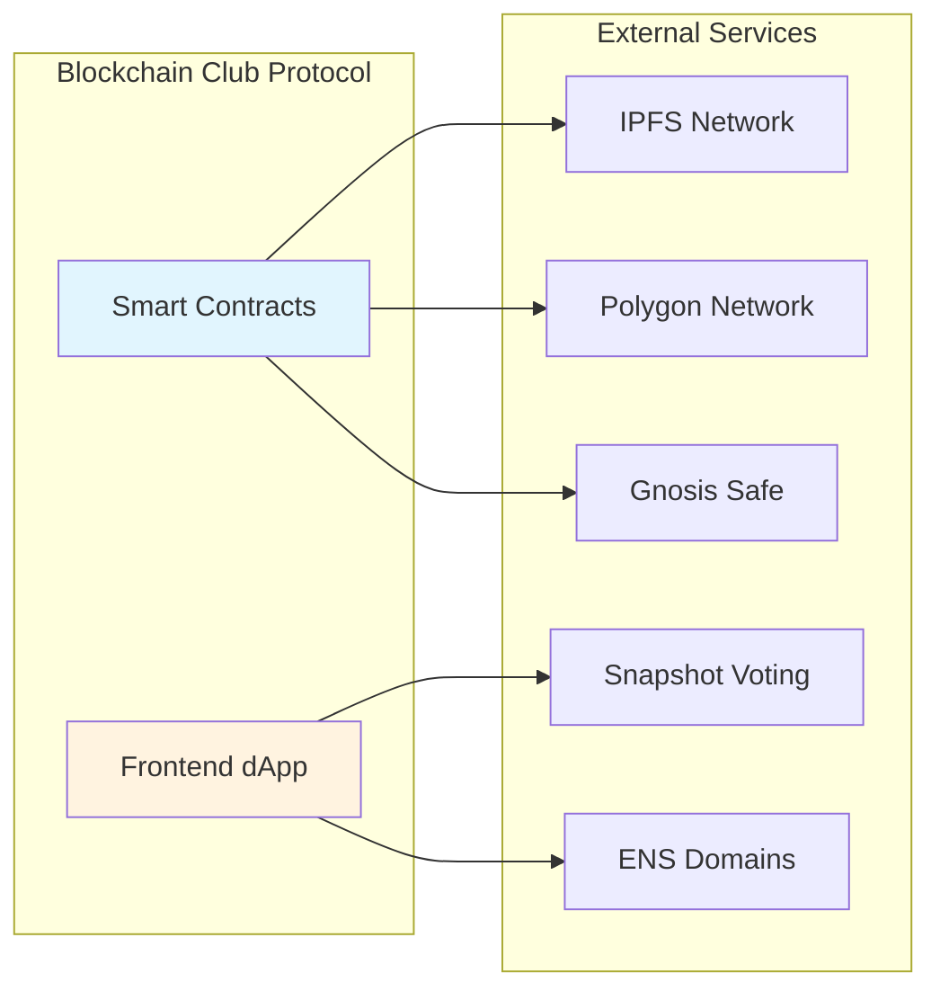

# System Diagrams

This document contains all architectural and flow diagrams for the UCD Blockchain Club Protocol.

## Table of Contents
1. [System Architecture](#system-architecture)
2. [User Journey](#user-journey)
3. [Treasury Flow](#treasury-flow)
4. [Role Hierarchy](#role-hierarchy)
5. [Token Type Mapping](#token-type-mapping)
6. [Gas Analysis](#gas-analysis)
7. [State Machines](#state-machines)

---

## System Architecture

### Complete System Overview

### Simplified Architecture (README Version)

---

## User Journey

### Member Onboarding Journey

---

## Treasury Flow

### Treasury Transaction Flow

---

## Role Hierarchy

### Access Control Structure

---

## Token Type Mapping

### NFT Token Types to Smart Contract Roles

---

## Gas Analysis

### Contract Deployment Costs

---

## State Machines

### Whitelist Request State Machine

### NFT Lifecycle State Machine

---

## Integration Flow

### External Service Integration

---

*These diagrams provide comprehensive visual documentation of the UCD Blockchain Club Protocol architecture and workflows.*
