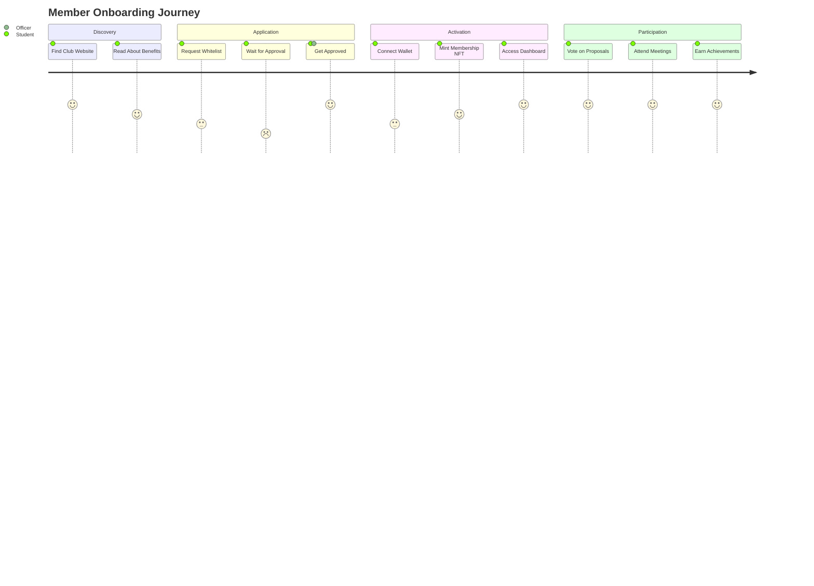
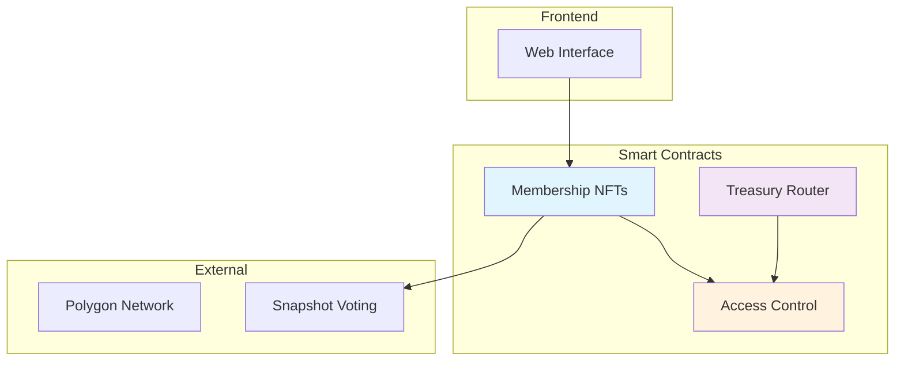
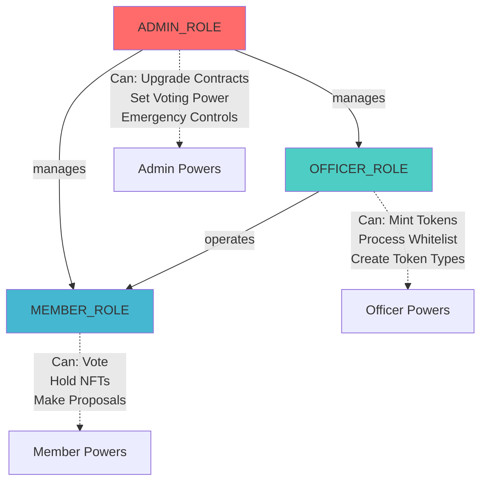
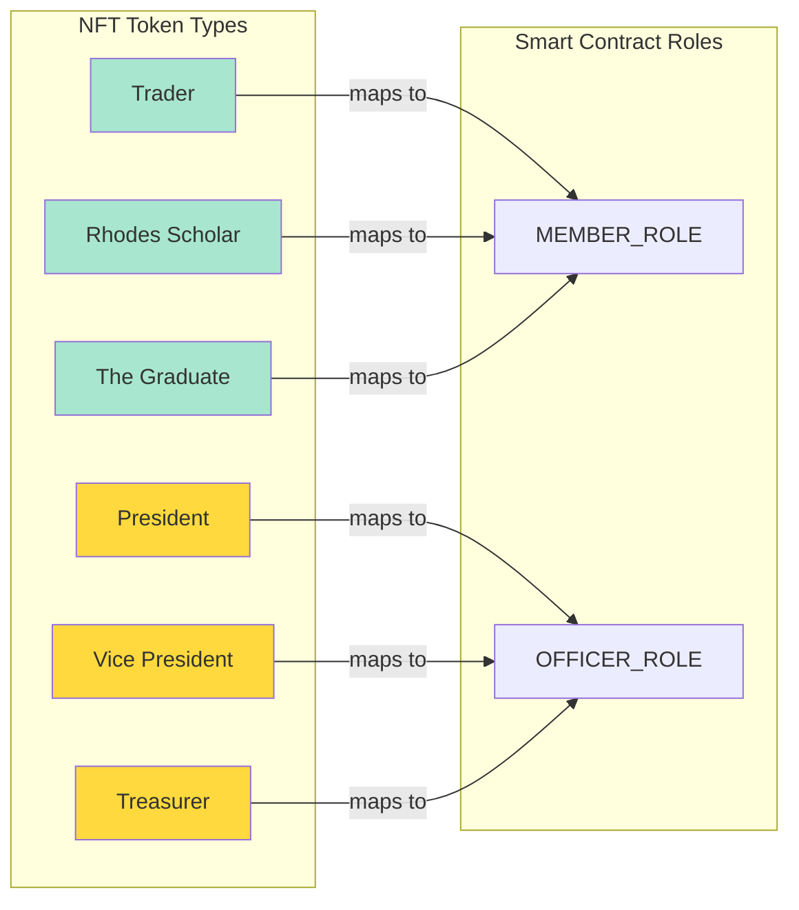

**Blockchain & Crypto Investing Club: Technical Whitepaper**

**Version 1.0 | July 2025**

---

### Executive Summary

* The University of Colorado Denver Blockchain Club implements on-chain governance through audited smart contract infrastructure.
* The architecture operates on decentralized protocols, establishing verifiable transparency, programmatic accountability, and operational resilience.
* Membership verification utilizes soulbound NFTs, governance implements tiered access controls, and treasury operations enforce mandatory 24-hour security delays with role-based authorization.
* This implementation establishes reference architecture patterns for academic decentralized autonomous organizations.

---

## 1. Introduction

The Blockchain & Crypto Investing Club bridges theoretical blockchain education with practical protocol implementation. The system provides direct interaction with institutional-grade smart contracts, decentralized finance protocols, and programmatic asset management.

This specification documents the technical architecture, governance mechanisms, and operational framework. The intended audience includes protocol developers, institutional partners, security auditors, and academic collaborators.

---

## 2. Problem Statement

**Challenges in Traditional Student Organizations:**

* Decision-making and financial operations lack transparency.
* Member contributions are not verifiable or formally recognized.
* Investment experience is typically simulated, not real.
* Leadership transitions risk continuity and institutional memory.

**Limitations of Web2 Infrastructure:**

* Spreadsheets, forms, and manual tracking introduce friction.
* Permission management is fragmented across apps.
* Record-keeping is non-portable and unauditable.

**Technical Assessment:**
Blockchain infrastructure provides cryptographically verifiable record-keeping, deterministic access control, programmatic governance execution, and immutable operational state. This protocol applies distributed systems principles to institutional governance frameworks.

---

## 3. System Overview

**Protocol Architecture:**

* **Roles.sol**: Hierarchical access control implementing role-based permissions with enumerable voting power distribution.
* **BlockchainClubMembership.sol**: ERC721-based membership tokenization with soulbound properties, role integration, and whitelist governance.
* **TreasuryRouter.sol**: Time-delayed asset management protocol supporting ETH, ERC20, and ERC721 transfers with comprehensive security mechanisms.

**Infrastructure:** Polygon provides low-cost execution with Ethereum Virtual Machine compatibility. Implementation utilizes OpenZeppelin's UUPS proxy pattern for upgradeability without compromising decentralization.

### User Journey



### System Architecture



---

## 4. Governance Model

### Dual-Layer Architecture

The protocol implements a sophisticated **two-layer governance system** that separates organizational identity from technical permissions, enabling institutional flexibility while maintaining smart contract security.

**Layer 1: Smart Contract Roles (Technical Permissions)**
* `ADMIN_ROLE` — Protocol upgrades, role management, treasury configuration
* `OFFICER_ROLE` — Token minting, whitelist governance, operational control  
* `MEMBER_ROLE` — Participation rights, governance voting, asset custody

**Layer 2: Token Types (Organizational Identity)**
* `President`, `Vice President`, `CFO`, `Treasurer` — Officer-level organizational positions
* `Officer`, `Major Key Alert` — Generic officer designations
* `Trader`, `Rhodes Scholar`, `The Graduate` — Member-level achievements and specializations

### Strategic Benefits of Separation:

**Organizational Agility:** New executive positions can be created via NFT metadata without smart contract modifications, enabling rapid adaptation to institutional needs.

**Social Recognition:** Individual achievements and organizational roles receive permanent verification while maintaining appropriate technical access controls.

**Governance Scalability:** Multiple organizational titles can map to the same permission level, supporting complex institutional hierarchies without contract complexity.

**Frontend Integration:** Applications can simultaneously display meaningful organizational roles while enforcing appropriate blockchain-level permissions based on token type mapping.

### Role Hierarchy Visualization



### Token Type Mapping



### Current Tiered Roles:

* **Admin** (ADMIN_ROLE)
* **Officer** (OFFICER_ROLE) 
* **Member** (MEMBER_ROLE)

### Hierarchical Access Control:

**Role Definitions:**
* **Admin** (ADMIN_ROLE)
  * Protocol upgrades and contract modifications
  * Officer appointment and role assignment
  * Treasury routing configuration
  * Custom voting power assignment
* **Officer** (OFFICER_ROLE)
  * Token type creation and configuration
  * Membership minting and issuance
  * Whitelist governance and management
* **Member** (MEMBER_ROLE)
  * NFT ownership and custody
  * Governance participation rights

### Voting Power Distribution:

* Implemented on-chain within `Roles.sol` storage
* Officer tier receives 5x voting weight multiplier
* Member tier receives standard 1x voting weight
* Individual voting power overrides configurable per address

### Governance Evolution Roadmap:

The protocol roadmap focuses on progressive enhancement of governance capabilities and institutional adoption:

1. **Snapshot Integration** — Token-weighted off-chain governance (Q3 2025)
2. **Production Deployment** — Polygon mainnet with institutional treasury management (Q4 2025)
3. **Multi-Institutional Framework** — Cross-university governance protocols (2026+)

📍 [Complete strategic roadmap and future vision](./roadmap.md)

### Implementation Pattern:

The dual-layer architecture enables sophisticated permission mapping in frontend applications:

```typescript
// Frontend Logic: Token Type → Role Mapping
function getPermissionLevel(tokenMetadata: string): string {
  if (tokenMetadata.includes('president') || 
      tokenMetadata.includes('cfo') || 
      tokenMetadata.includes('officer')) {
    return 'OFFICER_ROLE';  // Technical permission
  }
  return 'MEMBER_ROLE';
}

// Display: Shows organizational title for social recognition
function getDisplayTitle(tokenMetadata: string): string {
  return tokenMetadata.includes('president') ? 'Club President' : 
         tokenMetadata.includes('cfo') ? 'Chief Financial Officer' :
         'Officer';  // Social identity preserved
}
```

This pattern allows the protocol to **evolve organizationally without smart contract upgrades** while maintaining **precise access control** through immutable blockchain roles.

---

## 5. Membership System

**Membership Tokenization Protocol:**

* Issued through `BlockchainClubMembership.sol` ERC721 implementation
* Token type configuration parameters:
  * Temporal minting constraints (start/end timestamps)
  * Supply limitations with real-time tracking
  * Access control policies (officer-restricted, whitelist-gated, or public)
* Soulbound token support with non-transferable enforcement per token ID
* Permissioned onboarding via cryptographic whitelist request system

**Automated Role Integration:**

* Officer-initiated minting triggers real-time role assignment
* On-chain member statistics with comprehensive tracking

**Protocol Applications:**

* Cryptographic access control for internal infrastructure
* Alumni and contributor verification with immutable records
* Comprehensive participation tracking with temporal data

---

## 6. Treasury Operations

**Asset Management Protocol:**

* Implemented through `TreasuryRouter.sol` with multi-asset support
* Time-delayed execution with 24-hour minimum hold period
* Role-based authorization for destination address modifications

**Security Architecture:**

* Temporal delay mechanism prevents immediate asset extraction
* Emergency withdrawal capabilities with hierarchical access control

**DAO Integration Framework:**

* Governance contracts will programmatically authorize fund releases
* Proposal-driven transfers with automated execution logic

---

## 7. Technical Summary

**Protocol Implementation:**

**Upgradeability Framework:** UUPS proxy pattern with role-based upgrade authorization via `onlyRole(ADMIN_ROLE)`

**Data Structures:** NFT type configuration utilizing `TokenTypeConfig` struct with comprehensive metadata

**Access Control Implementation:** OpenZeppelin AccessControl with custom `roleVotingPower` and `customVotingPower` mappings

**Minting Protocol:** Officer-gated authorization, temporal public mint windows, and per-token soulbound enforcement

**Temporal Security:** `RELEASE_DELAY = 24 hours` mandatory review period for all treasury deposits

**Performance Analysis:**
- Gas-optimized smart contracts with deployment size under 24KB limits
- Comprehensive static analysis completed with 95%+ code quality compliance
- Security audit via automated tooling with zero critical vulnerabilities

📊 [Complete technical specification](./architecture/technical-specification.md)  
🔍 [Security architecture details](./security)  
📈 [Performance analysis](./analysis/gas-analysis.md)

---

## 8. Strategic Assessment

Blockchain-based institutional governance represents a fundamental advancement in organizational transparency and operational efficiency. This protocol provides a comprehensive framework for educational institutions seeking verifiable, programmable governance systems.

**Immediate Technical Priorities:**

* Snapshot governance strategy integration
* Production deployment to Polygon mainnet
* Proposal execution system and token-gated infrastructure

**Long-term Strategic Objectives:**

* Multi-university protocol expansion
* Cross-chain DAO tooling implementation
* Formal security audit and institutional validation

---

**Technical Contact:**

* Website: https://untrackedtx.xyz
* Repository: [https://github.com/blockchain-club](https://github.com/blockchain-club)
* Protocol Lead: [Liam.Murphy@ucdenver.edu](mailto:Liam.Murphy@ucdenver.edu)

---

*This whitepaper will be revised as technical capabilities and governance mechanisms evolve.*
